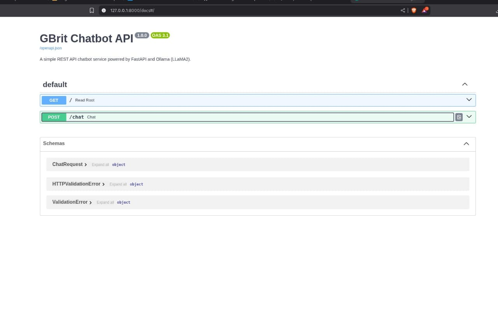
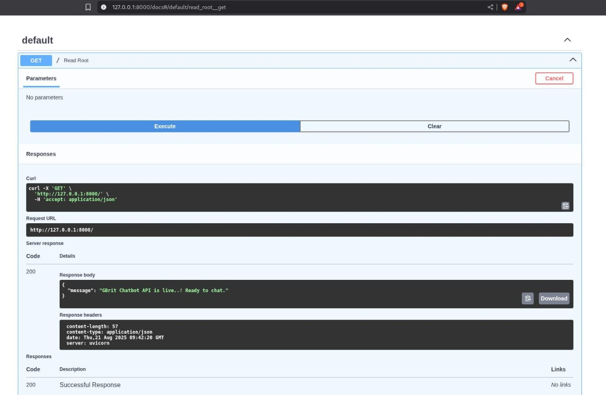
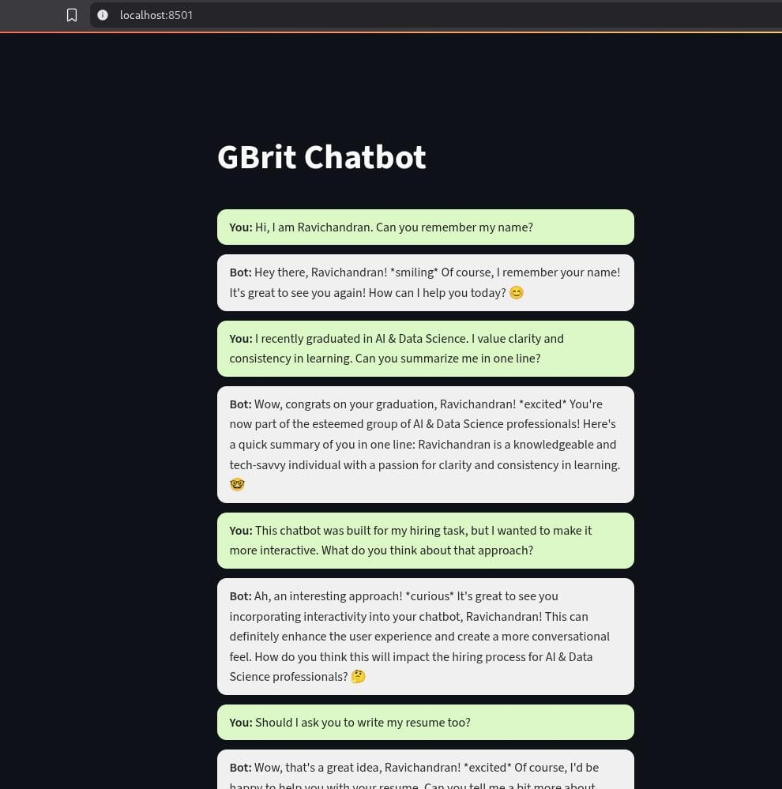

# 💬 GBrit Chatbot – REST API & Interactive GUI

*A chatbot built with clarity and care — simple at its core, extended with creativity.*  

***

## 👋 Introduction

I’m **Ravichandran**, an AI & Data Science graduate (2025).  
I approach work with a simple belief: learning grows best when practiced with **clarity, consistency, and focus**.  

This repository is my submission for the **GBrit Solutions hiring task**.  
The assignment was to build a **REST API chatbot** — and I delivered that ✅.  

But beyond that, I extended it into a **user-friendly chatbot web app** with:  
- Context-aware responses  
- Conversation history  
- Interactive Streamlit UI  

So, this project is both:  
- The *core API* (as required) and  
- An *extended demo*   

***

## ⚙️ Requirements

Install these before running:

- **Python 3.10+**
- **Pip**  
- **Ollama** → [Download here](https://ollama.com/download)  
  Test with:  
  ```bash
  ollama run llama2
  ```
  If the model responds, Ollama is ready.  

(Optional) **Postman** → [Download](https://www.postman.com/downloads/) (for testing APIs).  

***

## 📂 Project Structure

```bash
gbrit-chatapi/
├── simple_chatbot/           # Core task: REST API chatbot
│   ├── app.py                # FastAPI app (minimal version)
│   ├── favicon.ico           # Small polish (avoids 404 in browser tab)
│   └── requirements.txt
│
├── chatbot_gui/              # Extended version: API + Streamlit GUI
│   ├── app.py                # FastAPI app with chat history
│   ├── gui.py                # Streamlit interactive UI
│   ├── favicon.ico
│   └── requirements.txt
│
├── postman_collection.json   # Ready-to-import Postman tests
└── README.md                 # Documentation (this file)
```

***

## 🚀 Setup

### 1. Clone the repository
```bash
git clone https://github.com/KRC0720/gbrit-chatapi.git
cd gbrit-chatapi
```

### 2. Create virtual environment
```bash
python -m venv venv
```

Activate it:  
- **Linux/Mac**: `source venv/bin/activate`  
- **Windows**: `venv\Scripts\activate`  

### 3. Install dependencies

For **simple chatbot**:
```bash
pip install -r simple_chatbot/requirements.txt
```

For **chatbot GUI**:
```bash
pip install -r chatbot_gui/requirements.txt
```

***

## 🔹 Running the Simple Chatbot (Required Task)

1. Move into folder:
   ```bash
   cd simple_chatbot
   ```
2. Start server:
   ```bash
   uvicorn app:app --reload
   ```
3. Access:
   - Root: [http://127.0.0.1:8000/](http://127.0.0.1:8000/)  
   - Swagger Docs: [http://127.0.0.1:8000/docs](http://127.0.0.1:8000/docs)  

📦 API Endpoints:
- `GET /` → Health Check  
- `POST /chat` → Send message  

Request:
```json
{ "message": "Hello!" }
```

Response:
```json
{ "response": "Hi Ravichandran, how can I help you today?" }
```

***

## 🔹 Running the Extended GUI Version (Extra Demo)

⚠️ The GUI requires **two terminals** (because API and Streamlit run separately).

### 1. Start Backend Server
In **Terminal 1**:
```bash
cd chatbot_gui
uvicorn app:app --reload
```
Runs at: [http://127.0.0.1:8000](http://127.0.0.1:8000)

### 2. Start Streamlit Frontend
Open **Terminal 2** (keep API running in the first one):
```bash
cd chatbot_gui
streamlit run gui.py
```
Runs at: [http://localhost:8501](http://localhost:8501)

 #### Now you’ll see a chatbot interface :
- Input box → type requests  
- Replies appear in chat bubbles  
- Turns are interleaved user/bot style  
- Messages stored in history  


##  Testing with Postman

Use the included `postman_collection.json`.  

Steps:  
1. Open Postman  
2. Import → Choose `postman_collection.json`  
3. Three saved examples already included:  
   - **Mindset (Q1)**  
   - **Readiness (Q2)**  
   - **AI Trends (Q3)**  

Click **Send** → and see responses instantly.

***

## 📸 Screenshots

### 1. API Health Check  
This screenshot shows the response from the `GET /` endpoint, confirming the API is live and running.  



---

### 2. Swagger Docs – Chat Test  
Here I used Swagger UI to test the `/chat` endpoint. I asked the bot to remember my name, and it successfully responded with context.  



---

### 3. Streamlit Chatbot Demo  
This is the extended demo running on Streamlit. The screenshot shows an interactive chatbot conversation with messages displayed in chat bubble style.  




## ✍️ Author

I’m **Ravichandran K**, an **AI & Data Science graduate (2025)**.  

I approach projects with the belief that **clarity + consistency = good work**.  
This chatbot was not just a hiring task, but an **exercise in focus and problem‑solving** — built with care, extended with initiative.  